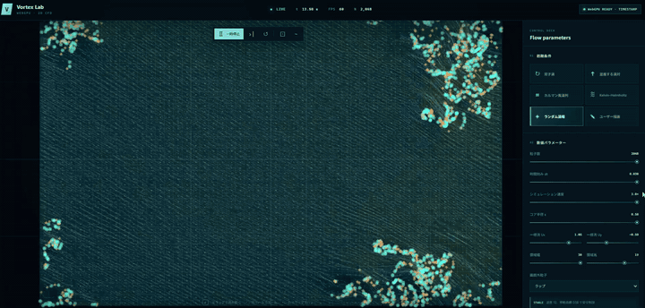

# Vortex Lab — WebGPU 2D CFD

ブラウザーの WebGPU Compute Shader だけで時間発展を計算する、2次元・非圧縮・非粘性の正則化渦粒子法シミュレーターです。バックエンド、外部 API、データベースは使用せず、GitHub Pages の静的配信で動作します。

科学的な挙動を持つ小規模な教育・可視化・アルゴリズム実験用アプリです。単なるパーティクルアニメーションではなく、各渦粒子間の Biot–Savart 相互作用を GPU 上で直接評価します。

## デモ

プリセットを切り替えながら、渦粒子とパッシブトレーサーが速度場に沿って発展する様子です。



アプリの「スクリーンショット」ボタンから、任意の状態を PNG でも保存できます。

## 数値モデル

各粒子は位置 `(x, y)`、循環 `Γ`、コア半径 `ε`、速度 `(u, v)`、年齢、有効フラグを持ちます。粒子 `j` が粒子 `i` に誘起する速度は、特異性を避けた次の正則化 Biot–Savart 則です。

```text
rᵢⱼ² = (xᵢ - xⱼ)² + (yᵢ - yⱼ)²

uᵢ = Ux + Σ[j≠i] -Γⱼ/(2π) · (yᵢ-yⱼ)/(rᵢⱼ²+εⱼ²)
vᵢ = Uy + Σ[j≠i]  Γⱼ/(2π) · (xᵢ-xⱼ)/(rᵢⱼ²+εⱼ²)
```

正則化は「速度評価点」ではなく「渦度源」の広がりを表すため、分母には源粒子 `j` の `εⱼ` を使います。自己項、無効粒子、ゼロ循環粒子は寄与しません。一様流 `(Ux, Uy)` は全粒子とパッシブトレーサーに加算されます。

### 時間積分と安定化

陽的 Euler 法ではなく2次精度の陽的中点 RK2 法を使用します。

1. 時刻 `n` の位置で速度 `k₁` を計算
2. `xⁿ + dt·k₁/2` に中点粒子を構成
3. 中点で速度 `k₂` を再計算
4. `xⁿ⁺¹ = xⁿ + dt·k₂`

速度は既定で `12` にクランプされ、各粒子の実効時間刻みは `min(dt, 最大移動距離 / |u|)` に制限されます。NaN、無限大、極端な値はシェーダー内で検出し、安全な速度または無効粒子へ変換します。これらは発散を抑える安全策であり、物理モデルそのものの高精度化ではありません。

領域外処理はラップ、削除、反射から選べます。領域は無限流体の観察窓を近似したもので、周期境界に対応した Biot–Savart の鏡像和は計算していません。

## GPU 計算

計算モードは次の2種類です。

- **Direct（現行・厳密）**: 1スレッドが1つの渦粒子を担当し、全粒子を直接走査します。相互作用は **O(N²)** です。
- **Uniform Grid（集約・高速）**: 領域を `4²`～`32²` セルへ分割し、各セルの循環・循環重み付き重心・実効コア半径を集約します。正負の循環は相殺しないよう別々に保持し、粒子更新、トレーサー、速度場から再利用します。セル数を `C` とすると粒子更新はおおむね **O(NC)** です。

どちらも workgroup size は `64` で、フレーム中の粒子データ読戻しは行いません。計算後の Storage Buffer をそのまま描画パイプラインへ渡します。

RK2 は次の4パスで構成します。

```text
current ──velocity──> velocity scratch
current + velocity ──midpoint──> midpoint scratch
midpoint ──velocity──> velocity scratch
current + midpoint velocity ──final──> next
                                      └─ ping-pong swap
```

Direct速度計算は [`src/shaders/vortexVelocity.wgsl`](src/shaders/vortexVelocity.wgsl)、Grid集約は [`src/shaders/uniformGrid.wgsl`](src/shaders/uniformGrid.wgsl)、集約セルからの速度計算は [`src/shaders/gridVelocity.wgsl`](src/shaders/gridVelocity.wgsl) に分離しています。パスの切り替えは [`src/gpu/ComputePipeline.ts`](src/gpu/ComputePipeline.ts) が担当します。

### 速度比較

1. 「計算モード」を Direct にして、パフォーマンス欄の `DIRECT` が計測されるまで待ちます。
2. 初期条件や粒子数を変えず Uniform Grid に切り替えます。
3. `UNIFORM GRID` と `SPEEDUP` を確認します。`SPEEDUP = Direct時間 / Grid時間` なので、`1.00×` より大きいほど高速です。

GPU時間は同じRK2ステップ（トレーサー更新を含む）のタイムスタンプ移動平均です。少粒子では集約コストが勝ってGridが遅い場合があります。Grid解像度を上げるほど空間近似は細かくなりますが、計算量も増えます。

### TS / WGSL バッファレイアウト

粒子1件は `vec4<f32>` 3個、合計48 bytesです。16-byte境界に揃え、TypeScript と WGSL でストライドを固定しています。

| offset | WGSL | 内容 |
|---:|---|---|
| 0 | `vec4<f32> positionGammaCore` | `x, y, Γ, ε` |
| 16 | `vec4<f32> velocityAgeActive` | `u, v, age, active(0/1)` |
| 32 | `vec4<f32> metadata` | 将来の境界・物体連成用予約 |

Simulation Uniform は64 bytesです。粒子数、トレーサー数、境界方式、履歴位置、`dt`、領域、速度・移動制限、一様流、時間、速度場解像度、履歴長を16-byte単位で配置します。

## 可視化

- 正循環は円形・シアン、負循環は菱形・オレンジで表示
- 循環強度に応じた大きさ、輝度、控えめな発光表現
- GPU 上で移流するパッシブトレーサーとリングバッファ式流跡線
- GPU でサンプリングした速度ベクトルと速度ヒートマップ
- 背景グリッド、主グリッド、座標軸
- 渦粒子、トレーサー、速度ベクトル、ヒートマップ、複合の5モード
- パン、カーソル中心ズーム、全体表示、PNG 保存

正負は色だけでなく形状と輪郭でも区別します。Auto 品質は FPS に応じてトレーサー上限、履歴長、速度場密度、描画解像度、更新回数を変更しますが、解析渦粒子数は変更しません。

## プリセット

| プリセット | 内容 |
|---|---|
| 双子渦 | 同符号・等強度の2渦。循環重心の周囲を回転 |
| 並進する渦対 | 逆符号・等強度の2渦。間隔を保って並進 |
| カルマン風渦列 | 正負の渦を上下交互に配置 |
| Kelvin–Helmholtz | 微小な正弦擾乱を与えた2列の渦層 |
| ランダム渦場 | 総循環がほぼゼロの再現可能な渦群 |
| ユーザー描画 | 空の領域から正負の渦を自由に追加 |

## 操作

- 左クリック / 1本指タッチ: 渦を追加
- 左ドラッグ / 1本指ドラッグ: 渦を連続追加
- `Shift`: 選択中の循環符号を一時反転
- ホイール: ポインターを中心にズーム
- 中または右ドラッグ: パン
- 2本指ピンチ: ズーム
- 2本指ドラッグ: パン
- ツールバー: 再生、一時停止、1ステップ、リセット、全体表示、スクリーンショット

Canvas は `touch-action: none`、ページは固定レイアウトなので、操作中にページスクロールと競合しません。狭い画面では設定パネルがドロワーになります。

## WebGPU 要件

- WebGPU 対応の最新版 Chrome / Edge など
- HTTPS または `localhost`
- WebGPU を利用できる GPU とドライバー

利用できない場合は黒画面や例外停止にせず、対応ブラウザー、HTTPS、ドライバー、ソフトウェアレンダリング性能についての案内を表示します。`timestamp-query` 非対応時も計算は継続し、GPU時間のみ「計測待ち」になります。

## 開発

Node.js 22 以降を推奨します。

Windowsでは [`start-vortex-lab.bat`](start-vortex-lab.bat) をダブルクリックすると、ソースを `%LOCALAPPDATA%\VortexLabWebGPU` へ同期し、初回のみ依存関係をインストールして、開発サーバーとブラウザーを自動起動できます。Google Drive上での `node_modules` 展開エラーを避けるための構成です。表示されるコマンド画面を閉じるとサーバーも終了します。

```bash
npm install
npm run dev
npm run test
npm run lint
npm run build
npm run preview
```

`npm run test` は CPU f64 参照実装で次を検証します。

- 単一渦の自己誘起速度がゼロ
- 同符号2渦の回転と重心保存
- 逆符号2渦の並進と距離保存
- ゼロ循環粒子の非寄与
- 対称配置の保存
- 48-byte GPU レイアウトのパック / アンパック

さらにアプリ起動時に、少数渦の GPU f32 速度を一度だけ読み戻して CPU 結果と比較します。通常のアニメーションでは読戻しません。

## GitHub Pages へ公開

1. リポジトリを GitHub に push します。
2. GitHub の **Settings → Pages → Build and deployment → Source** を **GitHub Actions** にします。
3. `main` へ push するか、Actions の `Deploy Vortex Lab to GitHub Pages` を手動実行します。

[`deploy-pages.yml`](.github/workflows/deploy-pages.yml) が `npm ci`、lint、test、TypeScript、本番ビルドを実行し、`dist/` を Pages に公開します。Vite の `base: './'` と相対アセットを使うため、ユーザーサイト、プロジェクトサイト、カスタムドメインのいずれでも動作します。クライアントルーターを使わない単一ページ構成なので、リロード時のルート404もありません。Pages の HTTPS 上では secure context として WebGPU を利用できます。

ローカルで Pages 相当の相対パスビルドを明示確認する場合:

```bash
npm run build:pages
```

## 構成

```text
src/
  app/             App, SimulationController
  gpu/             context, buffers, compute/render pipelines, profiler
  rendering/       camera, quality, screenshot
  shaders/         Biot–Savart, RK2, tracer, field, rendering WGSL
  simulation/      types, presets, CPU reference, validation, layout
  ui/              controls and performance presentation
  styles/          responsive scientific UI
```

## 性能と精度の制約

- Direct相互作用は O(N²)。Uniform Gridは固定セル数に対しておおむね O(NC) です。既定最大粒子数は2,048で、実用上限はGPUによって大きく異なります。
- GPU計算は f32。CPU参照の f64 より丸め誤差が大きく、長時間では軌道位相がずれます。
- 速度場描画にも `粒子数 × サンプル数` の計算が必要です。
- 正則化コアと速度・移動制限は安定化に有効ですが、空間収束性を保証しません。
- Uniform Gridはセル内の渦を集約する近似です。Directと同一軌道になることは保証せず、精度が必要な比較ではGrid解像度を上げるかDirectを使用します。
- 非粘性モデルなので、粘性拡散、壁面境界層、抗力を再現しません。
- 背景タブ、省電力モード、統合GPU、モバイルの熱制限で性能が変動します。

## 現時点で未実装

- 円柱・任意形状の固体境界
- パネル法、境界渦法、Brinkman penalization、SDF 障害物
- 粘性・渦コア拡散・渦伸長
- Particle-Mesh、Barnes–Hut、FMM
- 周期 Green 関数や鏡像渦による厳密な境界条件
- 解析状態の保存、動画書き出し、工業解析形式の入出力

## 将来計画

1. Particle-Mesh による大規模化とUniform Gridの近傍セル精密化
2. 円柱 SDF と境界渦法による円柱後流
3. 渦コア拡散法による粘性近似
4. 保存量（循環、力積、角力積）の継続監視
5. GPU 回帰テストと複数アダプターのベンチマーク

## 利用上の注意

このアプリは教育、可視化、数値アルゴリズムの実験を目的としています。工業製品の認証解析、設計保証、事故調査、医療・防災・安全判断へ直接使用しないでください。結果にはモデル化誤差、離散化誤差、f32 丸め誤差、有限粒子数、正則化、安定化制限の影響が含まれます。

## License

[MIT](LICENSE)
